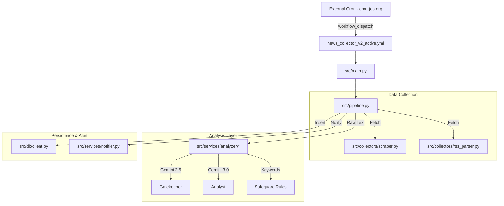

# System Architecture (As-Built)

**Version**: 1.0.0
**Context**: MarketPulse-Reg (Regulatory News Analysis)
**Status**: Round 6-8 hardening complete

## 1. High-Level Architecture
The system follows a **Serverless Event-Driven** pattern using GitHub Actions as the primary execution environment.



---

## 2. Directory Structure (File Map)
This map reflects the **actual** codebase after round 1 refactor.

```
reg_brief/
├── .github/
│   └── workflows/
│       └── news_collector_v2_active.yml  # Production collector (triggered by external cron-job.org via workflow_dispatch)
├── config/
│   ├── agencies.json           # Target Agency Config (single source of truth)
│   └── safeguard_keywords.json # Keyword Override Rules
├── docs/                       # Documentation Assets
├── db/
│   └── schema.sql              # v1 schema snapshot (see Schema status below)
├── scripts/
│   └── v2_schema_setup.sql     # v2 schema snapshot (see Schema status below)
├── src/
│   ├── collectors/
│   │   ├── http.py             # HTTP fetch helpers
│   │   ├── date_parser.py      # Date normalization
│   │   ├── pagination.py       # Pagination helpers
│   │   ├── list_scraper.py     # List page scraping
│   │   ├── content_scraper.py  # Detail page scraping
│   │   ├── sanction_scraper.py # FSS sanction scraping
│   │   ├── rss_parser.py       # RSS parsing
│   │   └── scraper.py          # Facade
│   ├── config/
│   │   ├── settings.py         # Constants + env loading (Gemini model IDs via env)
│   │   ├── agency_codes.py     # Agency code constants (enum)
│   │   └── agency_loader.py    # Runtime-derived agency metadata (sanction codes)
│   ├── db/
│   │   └── client.py           # Supabase Connection
│   ├── services/
│   │   ├── analyzer/           # Hybrid analyzer package (see 4.1)
│   │   │   ├── hybrid.py
│   │   │   ├── prompts.py
│   │   │   ├── gemini_client.py
│   │   │   ├── result_mapper.py
│   │   │   └── safeguards.py
│   │   └── notifier.py         # Telegram Bot Logic
│   ├── utils/
│   │   ├── logger.py           # Centralized Logging
│   │   └── preserve.py         # analysis_result 키 보존 헬퍼 (admin/backfill 스크립트용)
│   ├── main.py                 # [Entry Point] Production Runner
│   └── pipeline.py             # [Core] Orchestration Logic
└── web/                        # Frontend (Next.js)
    ├── app/
    │   ├── page.tsx            # Live entry → DashboardV2
    │   ├── login/              # Login page
    │   └── api/
    │       ├── auth/login/     # Passcode → mp_session cookie
    │       └── report/         # Report endpoint (auth-guarded)
    ├── components/
    │   └── dashboard/
    │       ├── DashboardV2.tsx       # Live entry. round6-8에서 Sidebar/AgencyIcon/constants/useHasNewByCategory 등으로 분해됨
    │       └── ...                   # Header, NewsCard, SearchBar, StarRating, DateSection 등 기존 컴포넌트 유지
    ├── lib/
    │   ├── auth.ts             # HMAC session cookie helpers
    │   ├── prompts/report.ts   # buildReportPrompt() — report prompt template
    │   └── validation/report.ts # /api/report request schema
    ├── __tests__/              # vitest suites (api + lib)
    └── proxy.ts                # Route protection (mp_session cookie guards /api/*)
```

Tests live in `tests/unit/**` (pytest) and `web/__tests__/**` (vitest); both
are executed on PRs by `.github/workflows/ci.yml` (`python-test`,
`web-test`, `gitleaks` jobs).

The configured agency count is the length of the `agencies` array in
`config/agencies.json` (single source of truth).

---

## 3. Data Flow (Pipeline)
1.  **Collection**: `main.py` triggers `pipeline.run()`. Scrapers fetch data from agencies.
2.  **Deduplication**: `pipeline._is_duplicate()` checks `link` against DB.
3.  **Processing**:
    - **Step 1**: Tier 1 filter (Gemini 2.5) -> Score 0-5.
    - **Step 2**: Keyword safeguards -> Force Score 4/5 if keyword matches.
    - **Step 3**: Tier 2 analysis (Gemini 3.0) -> Runs only if Score >= threshold.
4.  **Storage**: `pipeline._save_item()` inserts JSON payload to Supabase.
    `pdf_url`이 있는 항목(주로 sanction)은 insert 직전에 `analysis_result` JSON 안으로 merge되어 단일 컬럼에 저장된다.
5.  **Alerting**: `notifier.format_and_send()` sends Telegram msg ONLY if `analysis_result` exists.

## 4. Key Components Detail

### 4.1 Hybrid Analyzer (`src/services/analyzer/`)
After round 1 refactor, the analyzer is a package, not a single file. Each
module owns a single responsibility; refer to the source for current
signatures.

- `hybrid.py` — orchestrates the 2-Tier + Safeguard strategy.
- `prompts.py` — prompt templates for Tier 1/Tier 2.
- `gemini_client.py` — Gemini API client wrapper. round5에서 `google-genai` SDK 기반으로 마이그레이션. 회귀 테스트는 `tests/unit/analyzer/test_gemini_client.py`.
- `result_mapper.py` — maps raw model output to internal result shape.
- `safeguards.py` — keyword-based score override rules.

Backend Gemini model IDs are env-driven via `src/config/settings.py`:
`GEMINI_FILTER_MODEL` (Tier 1), `GEMINI_ANALYZER_MODEL` (Tier 2), and
`GEMINI_ANALYZER_FALLBACK_MODEL` (Tier 2 fallback). Defaults live in
`settings.py`. The frontend `/api/report` route uses a separate
`GEMINI_REPORT_MODEL` env (default in `web/app/api/report/route.ts`).
Gemini calls are fail-closed behind `GEMINI_ENABLED`: unless the value is
explicitly set to `true`/`1`/`yes`/`on`, backend analysis and the web
`/api/report` route do not create Gemini SDK clients even when
`GEMINI_API_KEY` is present.

### 4.1.1 Sanction agency derivation
`SANCTION_AGENCY_CODES` is no longer a hardcoded frozenset. It is derived
at runtime by `src/config/agency_loader.get_sanction_codes()` from the
`category` field of `config/agencies.json` (entries with
`category == "sanction_notice"`). Adding a new sanction source therefore
requires only a JSON edit. 동일 모듈의 `get_ssl_verify(code)`도 같은 패턴으로
per-agency TLS verify 정책을 단일 진실원(`config/agencies.json`)에서 도출한다.

### 4.1.2 SSL verification policy
- 기본값: `src/config/settings.py`의 `SSL_VERIFY = True` (round6에서 `False`→`True`로 반전).
- per-agency opt-out: `config/agencies.json`의 `ssl_verify: false` 필드.
- 적용: `src/collectors/sanction_scraper.py`가 `agency_loader.get_ssl_verify(code)`로
  값을 읽어 `http.fetch(url, verify=...)`에 전달.
- 검증: `.github/workflows/ssl-matrix-check.yml`이 verify on/off 매트릭스로 회귀를 점검.

### 4.2 Supabase Client (`src/db/client.py`)
- **Responsibility**: Singleton connection to PostgreSQL.
- **Connection Logic**:
    - **v1.0 (Prod)**: Uses `SUPABASE_URL` & `SUPABASE_ANON_KEY`.
    - **v2.0 (Dev/Preview)**: Uses `NEXT_PUBLIC_SUPABASE_URL_V2` & `NEXT_PUBLIC_SUPABASE_ANON_KEY_V2` if `NEXT_PUBLIC_USE_V2_DB=true`.

### 4.3 Environment Configuration (Secrets Map)
*Updated for v2.0 Dual-Environment Setup*

| Variable Name | Purpose | Target (Where to Set) |
|---------------|---------|-----------------------|
| `NEXT_PUBLIC_SUPABASE_URL_V2` | v2 DB Endpoint | **Github Secrets** (Actions), **Vercel** (Preview) |
| `NEXT_PUBLIC_SUPABASE_ANON_KEY_V2` | v2 DB API Key | **Github Secrets** (Actions), **Vercel** (Preview) |
| `NEXT_PUBLIC_USE_V2_DB` | v2 Switch Flag (`true`) | **Vercel** (Preview), Local `.env` |
| `ENV_TYPE` | Backend Branch Flag (`v2`) | **Github Actions** (`news_collector_v2.yml`) |
| `GEMINI_ENABLED` | Enables Gemini analysis/reporting only when explicitly true | **Github Actions**, **Vercel**, Local `.env` |
| `GEMINI_API_KEY` | Gemini API key, used only when `GEMINI_ENABLED` is true | **Github Actions**, **Vercel**, Local `.env` |
| `APP_PASSCODE` | Login passcode (server-side compare) | **Vercel** (Web), Local `.env` |
| `SESSION_SECRET` | HMAC key for `mp_session` cookie | **Vercel** (Web), Local `.env` |

### 4.4 Web Dashboard (`web/`)
- **Security**: Protected by `proxy.ts` (Cookie-based Auth). The
  `mp_session` cookie also gates all `/api/*` routes.
- **Visualization**: Reads directly from Supabase `articles` table.
- **`/api/report`**: Accepts only `{ articleId }` in the request body
  (schema in `web/lib/validation/report.ts`). The server then loads
  `title`, `content`, and `agency` from Supabase by id — clients cannot
  inject prompt content. The Gemini prompt is built by
  `buildReportPrompt()` in `web/lib/prompts/report.ts`, and the model id
  is taken from `GEMINI_REPORT_MODEL`. When `GEMINI_ENABLED` is not
  explicitly true, the route returns `503` before Supabase lookup or
  Gemini SDK construction.

### 4.5 Authentication
프론트엔드 인증은 서명된 `mp_session` HMAC 쿠키 기반이다. 사용자가 입력한
passcode는 `/api/auth/login` route 에서 서버측 `APP_PASSCODE` 환경변수와
비교되며, 일치하면 `SESSION_SECRET` 으로 서명된 세션 쿠키가 발급된다.
쿠키 발급/검증 로직은 `web/lib/auth.ts` 에 있고, 보호 대상 route는
`proxy.ts` 가 동일 헬퍼를 사용해 검사한다.

### 4.6 Schema status
현재 애플리케이션 코드와 `db/schema.sql` / `scripts/v2_schema_setup.sql`
사이에 불일치가 있을 수 있다. live DB 기준으로 검증한 뒤 적용하라.

### 4.7 Pipeline dependency injection (testability)
`Pipeline.__init__(config_path, *, analyzer=None, notifier=None, db=None, scraper=None)`.
None일 때 내부 헬퍼로 기본 구성하고, 단위 테스트는 fake를 주입해 외부 I/O 없이
오케스트레이션 흐름을 검증한다. 프로덕션 호출 경로(`src/main.py`)는 None만
넘기므로 동작이 동일하다.
