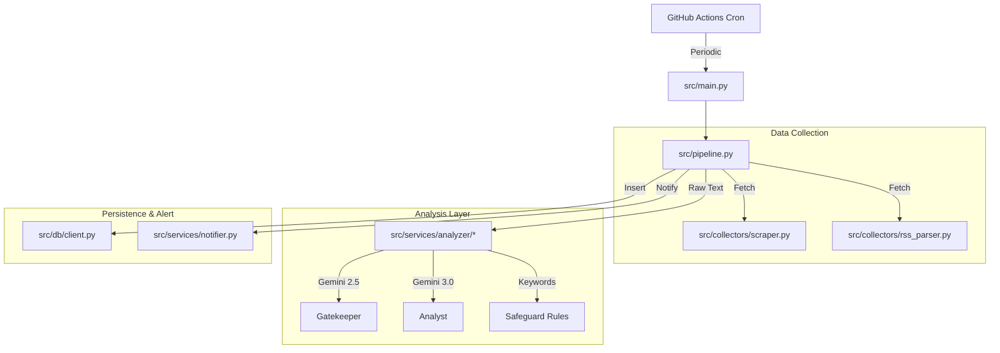

# System Architecture (As-Built)

**Version**: 1.0.0
**Context**: MarketPulse-Reg (Regulatory News Analysis)
**Status**: Stage 3 Complete

## 1. High-Level Architecture
The system follows a **Serverless Event-Driven** pattern using GitHub Actions as the primary execution environment.



---

## 2. Directory Structure (File Map)
This map reflects the **actual** codebase after round 1 refactor.

```
reg_brief/
├── .github/
│   └── workflows/
│       └── news_collector_v2_active.yml  # Production trigger (workflow_dispatch)
├── config/
│   ├── agencies.json           # Target Agency Config (single source of truth)
│   └── safeguard_keywords.json # Keyword Override Rules
├── docs/                       # Documentation Assets
├── db/
│   └── schema.sql              # v1 schema snapshot (see Schema status below)
├── scripts/
│   └── v2_schema_setup.sql     # v2 schema snapshot (see Schema status below)
├── src/
│   ├── collectors/
│   │   ├── http.py             # HTTP fetch helpers
│   │   ├── date_parser.py      # Date normalization
│   │   ├── pagination.py       # Pagination helpers
│   │   ├── list_scraper.py     # List page scraping
│   │   ├── content_scraper.py  # Detail page scraping
│   │   ├── sanction_scraper.py # FSS sanction scraping
│   │   ├── rss_parser.py       # RSS parsing
│   │   └── scraper.py          # Facade
│   ├── config/
│   │   ├── settings.py         # Constants + env loading
│   │   └── agency_codes.py     # Agency code constants
│   ├── db/
│   │   └── client.py           # Supabase Connection
│   ├── services/
│   │   ├── analyzer/           # Hybrid analyzer package (see 4.1)
│   │   │   ├── hybrid.py
│   │   │   ├── prompts.py
│   │   │   ├── gemini_client.py
│   │   │   ├── result_mapper.py
│   │   │   └── safeguards.py
│   │   └── notifier.py         # Telegram Bot Logic
│   ├── utils/
│   │   └── logger.py           # Centralized Logging
│   ├── main.py                 # [Entry Point] Production Runner
│   ├── pipeline.py             # [Core] Orchestration Logic
│   └── scheduler.py            # [LEGACY/UNUSED]
└── web/                        # Frontend (Next.js)
    ├── app/
    │   ├── page.tsx            # Live entry → DashboardV2
    │   ├── login/              # Login page
    │   └── api/
    │       ├── auth/login/     # Passcode → mp_session cookie
    │       └── report/         # Report endpoint (auth-guarded)
    ├── components/
    │   └── dashboard/
    │       └── DashboardV2.tsx # Live entry component
    ├── lib/
    │   └── auth.ts             # HMAC session cookie helpers
    └── middleware.ts           # Route protection
```

The configured agency count is the length of the `agencies` array in
`config/agencies.json` (single source of truth).

---

## 3. Data Flow (Pipeline)
1.  **Collection**: `main.py` triggers `pipeline.run()`. Scrapers fetch data from agencies.
2.  **Deduplication**: `pipeline._is_duplicate()` checks `link` against DB.
3.  **Processing**:
    - **Step 1**: Tier 1 filter (Gemini 2.5) -> Score 0-5.
    - **Step 2**: Keyword safeguards -> Force Score 4/5 if keyword matches.
    - **Step 3**: Tier 2 analysis (Gemini 3.0) -> Runs only if Score >= threshold.
4.  **Storage**: `pipeline._save_to_db()` inserts JSON payload to Supabase.
5.  **Alerting**: `notifier.format_and_send()` sends Telegram msg ONLY if `analysis_result` exists.

## 4. Key Components Detail

### 4.1 Hybrid Analyzer (`src/services/analyzer/`)
After round 1 refactor, the analyzer is a package, not a single file. Each
module owns a single responsibility; refer to the source for current
signatures.

- `hybrid.py` — orchestrates the 2-Tier + Safeguard strategy.
- `prompts.py` — prompt templates for Tier 1/Tier 2.
- `gemini_client.py` — Gemini API client wrapper.
- `result_mapper.py` — maps raw model output to internal result shape.
- `safeguards.py` — keyword-based score override rules.

Models are configured in `src/config/settings.py`, not hardcoded.

### 4.2 Supabase Client (`src/db/client.py`)
- **Responsibility**: Singleton connection to PostgreSQL.
- **Connection Logic**:
    - **v1.0 (Prod)**: Uses `SUPABASE_URL` & `SUPABASE_ANON_KEY`.
    - **v2.0 (Dev/Preview)**: Uses `NEXT_PUBLIC_SUPABASE_URL_V2` & `NEXT_PUBLIC_SUPABASE_ANON_KEY_V2` if `NEXT_PUBLIC_USE_V2_DB=true`.

### 4.3 Environment Configuration (Secrets Map)
*Updated for v2.0 Dual-Environment Setup*

| Variable Name | Purpose | Target (Where to Set) |
|---------------|---------|-----------------------|
| `NEXT_PUBLIC_SUPABASE_URL_V2` | v2 DB Endpoint | **Github Secrets** (Actions), **Vercel** (Preview) |
| `NEXT_PUBLIC_SUPABASE_ANON_KEY_V2` | v2 DB API Key | **Github Secrets** (Actions), **Vercel** (Preview) |
| `NEXT_PUBLIC_USE_V2_DB` | v2 Switch Flag (`true`) | **Vercel** (Preview), Local `.env` |
| `ENV_TYPE` | Backend Branch Flag (`v2`) | **Github Actions** (`news_collector_v2.yml`) |
| `APP_PASSCODE` | Login passcode (server-side compare) | **Vercel** (Web), Local `.env` |
| `SESSION_SECRET` | HMAC key for `mp_session` cookie | **Vercel** (Web), Local `.env` |

### 4.4 Web Dashboard (`web/`)
- **Security**: Protected by `middleware.ts` (Cookie-based Auth).
- **Visualization**: Reads directly from Supabase `articles` table.

### 4.5 Authentication
프론트엔드 인증은 서명된 `mp_session` HMAC 쿠키 기반이다. 사용자가 입력한
passcode는 `/api/auth/login` route 에서 서버측 `APP_PASSCODE` 환경변수와
비교되며, 일치하면 `SESSION_SECRET` 으로 서명된 세션 쿠키가 발급된다.
쿠키 발급/검증 로직은 `web/lib/auth.ts` 에 있고, 보호 대상 route는
`middleware.ts` 가 동일 헬퍼를 사용해 검사한다.

### 4.6 Schema status
현재 애플리케이션 코드와 `db/schema.sql` / `scripts/v2_schema_setup.sql`
사이에 불일치가 있을 수 있다. live DB 기준으로 검증한 뒤 적용하라.
