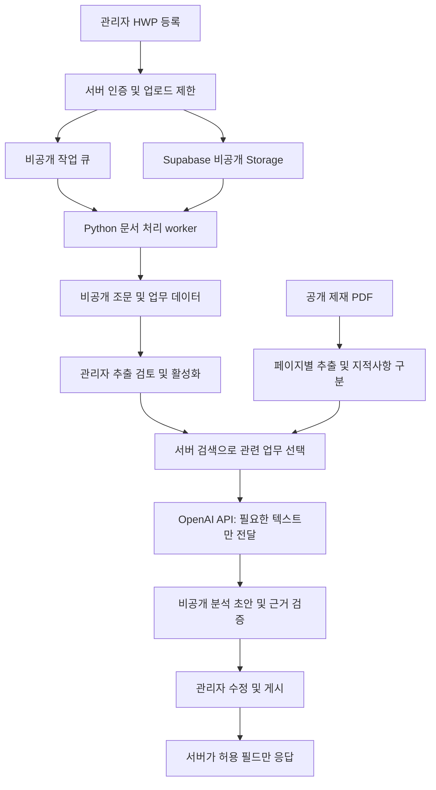

# 제재공시 기반 당행 점검 초안 — 설계

작성일: 2026-09-10
상태: 구현 제안. 코드·운영 DB·외부 서비스 설정은 아직 변경하지 않음.

## 1. 사용자 요구와 완료 범위

- 제재 PDF를 지적사항별로 분석하고, 당행 업무분장규정·업무분석서에서 관련 업무와 소관부서 후보를 찾는다.
- 부서 후보, 관련 업무, 점검 질문, 확인 증빙을 제시하고 관리자가 수정·확정한다.
- 관리자만 HWP 원본과 추출 내용을 관리한다. 일반 사용자는 허용된 분석 결과만 조회한다.
- 외부 저장 및 AI 분석은 허용되었지만 모델 학습 공유와 권한 밖의 원문 제공은 허용되지 않는다.
- 첫 버전에는 문서 관리, 제재별 초안, 관리자 검토·게시, 승인 결과의 XLSX 내보내기를 포함한다.
- 부서별 자동 발송, 회신 추적, 내부 문서 자유 질의는 후속 범위로 둔다.

## 2. 현재 구현에서 확인한 사실

| 근거 파일 | 관찰 | 설계에 미치는 영향 |
|---|---|---|
| `web/lib/auth.ts`, `web/app/api/auth/login/route.ts` | 공통 passcode, iat/exp만 있는 HMAC 세션 | 기존 세션만으로 관리자 권한을 부여하지 않는다. |
| `web/proxy.ts` | 점이 포함된 pathname을 인증 예외로 처리 | 신규 민감 API는 자체 인증을 수행한다. 프록시 예외도 실제 정적 경로 기준으로 좁히고 회귀검증한다. |
| `docs/SCHEMA.md`, `db/migrations/20260504145405_harden_articles_rls.sql` | `analysis_result`는 공개 클라이언트 SELECT 허용 대상 | 내부 근거, 초안, 게시 결과를 이 컬럼에 넣지 않는다. live 권한은 적용 전에 별도로 확인한다. |
| `web/app/api/report/route.ts` | Gemini 보고서와 `analysis_result` 캐시 | 기존 기사 보고서는 유지한다. 내부 문서를 이 경로에 전달하지 않는다. |
| `src/collectors/sanction_scraper.py`, `content_scraper.py` | PDF 링크 수집과 HTML 본문 수집 | PDF 페이지별 추출과 지적사항 분석 단계를 추가해야 한다. |
| `.github/workflows/news_collector_v2_active.yml` | Python 수집 작업, Gemini 비활성 | 일반 수집은 유지하고 내부 문서 작업을 공개 저장소 Actions에 싣지 않는다. |

위 내용은 저장소 기준이다. 운영 배포 버전·DB·계정 설정은 검증 전이다.

## 3. HWP 사전 검증의 범위

- 한 문서에서 조문 경계와 번호 업무를 이용한 구조 추출이 가능함을 확인했다.
- 사용자에게 제시한 5개 표본은 이상이 없어 보인다는 확인을 받았다.
- 이 확인은 전 조문·다른 문서의 정확성을 보장하지 않는다. 검토 전 추출 결과는 검색 활성화하지 않는다.
- 부서명 접미사는 후보를 찾는 보조 조건이다. 조직도와 동일한 부서 수라고 해석하지 않는다.
- 장/절, 조문, 부칙 경계를 보존하고 목차·개정 이력·미분류 구간은 별도로 보여준다.
- 조문 전체의 상위 조직, 업무 항목의 번호·하위 항목·교차 참조를 보존한다. 고정 글자 수로 부서 경계를 자르지 않는다.
- 근거 위치는 조문 번호와 추출 문단 위치를 사용한다. HWP 문단 번호를 페이지 번호로 표시하지 않는다.
- 실제 내부 문서명·경로·본문·조직명은 저장소의 계획, 테스트 fixture, 로그에 포함하지 않는다.

## 4. 권한과 화면

첫 버전은 일반 사용자의 기존 passcode 로그인을 유지하고, 관리자 전용 로그인을 추가한다.
관리자는 Supabase Auth 계정과 서버측 허용 사용자 ID 목록으로 식별하는 방안을 채택한다.
자기 가입만으로 관리자 권한을 얻을 수 없으며, 관리용 세션과 기존 일반 세션을 혼용하지 않는다.
관리자 계정 생성과 인증 방식의 실제 사용 가능 여부는 운영 설정 단계에서 확인한다.

| 행위 | 미로그인 | 일반 세션 | 관리자 |
|---|---|---|---|
| 기존 대시보드 | 기존 정책 | 허용 | 허용 |
| 점검 게시 결과 조회·내보내기 | 거부 | 허용 | 허용 |
| 분석 생성·초안 조회·수정·게시 | 거부 | 거부 | 허용 |
| HWP 등록·추출문·내부 근거·버전 관리 | 거부 | 거부 | 허용 |

- `/admin/documents`: 등록, 시행일, 버전, 추출 상태, 조문별 부서/업무 수정, 활성화, 폐기.
- 제재 상세: 관리자에게 `점검 초안 생성`, 일반 사용자에게 검토 완료 결과와 공개 PDF 근거만 표시.
- `/admin/inspections/[id]`: 지적사항, 부서 후보, 추천 근거, 점검 질문, 증빙 검토 및 게시.
- 내부 원문이나 관리용 검색 API는 일반 사용자 UI에 숨길 뿐 아니라 서버에서도 거부한다.
- 게시 전 초안에는 내부 문구가 포함될 수 있으므로 관리자만 접근한다. 필드 제한만으로 유출 방지를 완료했다고 주장하지 않는다.
- 로그인 사용자도 게시 결과를 통해 부서명과 관련 업무 일부를 알게 된다. 이것은 기능상 허용한 결과 범위이며 내부 정보의 완전 비공개와 구분한다.

## 5. 저장·처리 구조

### 저장

- 전용 private Storage bucket. 객체 키는 서버가 만든 ID이며 원본 파일명을 URL에 노출하지 않는다.
- 일반 `anon`/`authenticated` 역할에는 내부 테이블·Storage의 직접 조회 권한을 주지 않는다.
- 관리 API도 서버에서 관리자 ID를 검증한 뒤 접근한다. service-role 키는 서버에서만 사용하고 anon fallback은 금지한다.
- 업로드는 관리자 인증 후 발급한 업로드 전용 권한으로 구현할 수 있다. 다운로드용 서명 URL을 일반 사용자에게 발급하지 않는다.
- 업로드 완료 시 서버가 크기·해시·실제 포맷을 다시 검사한다. 브라우저의 MIME/파일명은 신뢰하지 않는다.
- 신규 결과는 `articles.analysis_result`와 분리한다. 일반 결과도 테이블 직접 공개 없이 인증된 서버 API로 제공한다.
- 앱 응답·내보내기는 `Cache-Control: private, no-store`. 원문·추출문·프롬프트·AI 응답 전체를 로깅하지 않는다.

### HWP 처리와 실행 위치

- 로컬 검증 도구는 pyhwp였다. 이 도구의 AGPL 라이선스, 운영 Python 호환성, 유지보수 상태를 확인한 후 운영 파서를 확정한다. 로컬 성공을 운영 채택 완료로 간주하지 않는다.
- 첫 지원 포맷은 검증한 HWP v5. HWPX, 암호화·배포용 문서, 스캔 이미지는 별도 상태로 안내하고 임의 텍스트로 통과시키지 않는다.
- 변환 프로세스는 네트워크 차단·시간/메모리/압축해제량 제한·작업별 임시 디렉터리에서 실행한다. 매크로나 임베디드 실행 파일을 실행하지 않는다.
- Next.js 요청 안에서 긴 변환을 끝내려 하지 않고, 비공개 큐를 읽는 Python worker로 분리한다.
- worker는 기존 Python 코드베이스와 DB 클라이언트를 재사용하되 수집기와 독립 진입점으로 실행한다. 운영 실행 위치는 상시 실행 가능한 컨테이너를 제안하며 서비스 계정·요금은 아직 선택하지 않았다.
- 개발에서는 로컬 worker와 합성 문서로 검증 가능하다. 신규 유료 서비스 가입은 계획 작성 범위에 포함하지 않는다.

### 검색·분석

1. 공개 PDF는 서버에 등록된 제재 article ID에서만 찾아 가져온다. 사용자 임의 URL은 받지 않는다.
2. 다운로드 호스트·리다이렉트·해석된 IP를 검증하고 사설망 접근과 과대 응답을 거부한다. 기존 HTTP/첨부 helper의 재사용 여부를 먼저 확인한다.
3. 페이지별 본문을 추출하고 PDF 해시·페이지를 기록한다. 텍스트가 없는 페이지는 OCR 필요로 남기며 빈 본문으로 분석을 완료하지 않는다.
4. 공시 한 건을 지적사항별로 나누고 원문 근거 범위를 보존한다. 타행의 사실과 당행 점검 제안을 구분한다.
5. 활성 문서의 조문·업무 단위에 대해 키워드와 조직/업무 메타데이터로 관련 후보를 검색한다. 인접 하위 항목과 참조 조문을 함께 가져온다.
6. 초기에는 로컬 검색을 기준으로 평가한다. 검색 누락이 확인될 경우에만 의미 검색을 추가하며 임베딩 데이터도 내부 문서와 같은 접근 제한을 적용한다.
7. 선택된 업무와 제재 지적사항만 API로 전송한다. 전체 문서를 자동 fallback으로 전송하지 않는다.
8. AI가 반환한 부서 ID와 근거 ID는 제공한 후보 집합에 존재해야 한다. 실제 근거와 맞는지 검증하고 불명확하면 `확인 필요`로 남긴다.
9. 문서와 PDF의 지시문은 데이터로 취급한다. 검색 도구·임의 네트워크·파일 접근 권한을 모델에 제공하지 않는다.
10. 공개용 결과는 짧은 업무 설명·부서 후보·점검 질문·확인 증빙으로 제한한다. 내부 원문 인용, 내부 경로, 검색 청크를 제거하고 관리자 확인 후 게시한다.

## 6. OpenAI 데이터 처리 요구

- 전용 API 프로젝트의 데이터 공유 opt-in이 꺼져 있는지 실제 계정에서 확인한다. 아직 확인하지 않았다.
- Responses 요청에는 `store: false`; background, Conversations, Files, hosted vector store는 이 초안 범위에서 사용하지 않는다.
- 원본 HWP는 OpenAI 파일 저장소에 올리지 않는다. worker가 선택한 텍스트만 요청한다.
- 학습 미사용과 무보관을 구분한다. 기본 악용 모니터링 보관이 있을 수 있고 `store: false`는 이를 제거하지 않는다.
- ZDR은 별도 승인·기능 적합성 확인이 필요하다. 현재 ZDR 적용 상태라고 표시하지 않는다.
- OpenAI 미설정 또는 비활성 시 내부 문서를 Gemini 등 다른 공급자로 보내지 않고 명시적 준비 필요 상태를 반환한다.
- 모델 ID는 서버 환경변수로 지정하고 계정에서 지원되는 모델을 구현 단계에 확인한다. 기존 Gemini 전역 설정은 바꾸지 않는다.

## 7. 데이터 모델 제안

다음은 신규 비공개 테이블의 역할이며 확정 SQL이 아니다. 모든 신규 테이블은 직접 클라이언트 접근을 거부한다.

| 테이블 | 핵심 데이터 |
|---|---|
| `internal_documents` | 문서 ID, 논리 문서 종류, 제목, 버전, 시행일, 해시, 객체 키, 상태, 관리자 ID |
| `internal_document_units` | 문서 ID, 조문 키, 상위 조직, 부서 후보 ID, 업무 번호, 본문, 근거 위치, 검토 상태 |
| `sanction_inspection_jobs` | 작업 종류, 상태, 대상 ID, 멱등 키, lease, 시도 횟수, 안전한 오류 코드 |
| `sanction_inspections` | article ID, PDF 해시, 문서 버전 집합, 모델/프롬프트/파서 버전, 상태, 수정 revision |
| `sanction_inspection_items` | 지적사항, 부서 후보, 내부 근거, 점검 질문, 증빙, 미확정 이유 |
| `sanction_inspection_publications` | 검토한 허용 필드 snapshot, 게시자, 게시 시각, revision, 철회 상태 |
| `sanction_inspection_events` | 사용자 ID, 행위, 대상 ID, 시각, 상태 전환; 본문 제외 |

- 조문 키는 문서 버전 안에서 유일하다. 후보 ID는 표시 이름과 분리하고 부서 개편 시 임의로 병합하지 않는다.
- PDF 해시·문서 버전 집합·분석 설정이 같으면 동일 작업을 재사용한다. 중복 클릭이 중복 과금을 유발하지 않게 한다.
- 문서는 등록→추출→검토 대기→활성/실패/폐기 상태를 갖는다. 새 버전 활성화는 원자적으로 처리한다.
- 분석은 대기→처리→검토 대기→게시/실패/구버전 상태를 갖는다. 수정은 revision 충돌을 검사한다.
- 문서 교체·폐기 시 이전 근거를 쓰는 결과를 구버전 표시하거나 철회하고 최신 결과로 위장하지 않는다.
- 삭제는 관리자에게 범위를 표시하고 원본·추출문·검색 인덱스·관련 초안/게시물 정책을 함께 처리한다. 감사 이벤트는 본문 없이 유지한다. 백업 만료는 저장 서비스 정책으로 별도 확인한다.

## 8. API 계약 초안

| 경로 | 권한 | 입력/출력 |
|---|---|---|
| `POST /api/admin/documents` | 관리자 | 문서 메타데이터 → 서버 생성 ID와 제한된 업로드 권한 |
| `POST /api/admin/documents/[id]/process` | 관리자 | 업로드 완료 확인 → 작업 ID |
| `GET/PATCH /api/admin/documents/[id]` | 관리자 | 검토용 추출·상태 조회 / 버전·검토 수정 |
| `POST /api/admin/documents/[id]/activate` | 관리자 | 검토한 버전 활성화 |
| `DELETE /api/admin/documents/[id]` | 관리자 | 명시된 삭제 범위 실행 |
| `POST /api/admin/sanction-inspections` | 관리자 | article ID → 중복 방지된 작업 ID |
| `GET/PATCH /api/admin/sanction-inspections/[id]` | 관리자 | 초안·근거 조회 / revision 포함 수정 |
| `POST /api/admin/sanction-inspections/[id]/publish` | 관리자 | 검토 확인 및 revision → 게시 snapshot |
| `GET /api/sanction-inspections?articleId=...` | 일반 또는 관리자 | 게시된 허용 필드만 반환 |
| `GET /api/sanction-inspections/[id]/export` | 일반 또는 관리자 | 게시본 기반 XLSX만 반환 |

route는 인증, 입력 검증, 서비스 호출만 담당한다. 공통 권한·DB·직렬화 helper를 재사용하고 뷰에 업무 규칙을 넣지 않는다.
변경 요청은 Origin/CSRF 검사, 크기 제한, 서버측 rate limit을 갖는다. worker는 큐를 pull하여 클라이언트 공개 callback을 만들지 않는다.

## 9. 수용 기준과 검토

- 관리자 외에는 원본, 추출문, 내부 근거, 미게시 초안을 UI·API·Storage·DB 직접 경로로 읽을 수 없다.
- 일반 세션, 위조 쿠키, 다른 사용자 ID, 점이 있는 경로, 내보내기 경로로 우회하지 못한다.
- 원문 포함 출력, 모델이 지어낸 부서·근거, prompt injection 표본은 게시 전 차단하거나 검토 필요 상태로 남긴다.
- 관리자 5개 표본 확인은 사전 증거로 유지한다. 합성 fixture와 추가 실제 사례 검토로 조문 경계·분류 누락을 검증한다.
- PDF 하나에 여러 지적사항, 이미지 PDF, 파싱 실패, 작업 재시도, 문서 버전 교체, 분석 수정 충돌을 검증한다.
- 일반 사용자는 게시 결과만 읽으며 내부 정보가 검색 응답, 에러, 로그, XLSX 숨김 시트, 클라이언트 bundle에 포함되지 않는다.
- 기존 기사 수집·분류·Gemini 보고서·로그인은 회귀 테스트를 통과한다.
- 구현 완료 후 작성자와 별도 review lane에서 권한·DB 공개 경계·원문 유출 경로를 검토한다. 이 계획은 자체 승인된 구현 결과가 아니다.

## 10. 운영 전 필요한 외부 설정

1. 대상 Supabase 프로젝트 확인, private bucket/신규 테이블 migration, 관리자 계정과 allowlist.
2. OpenAI API 프로젝트·서버 키·모델·데이터 공유 설정 확인. 키를 대화나 Git에 넣지 않는다.
3. Python worker 실행 서비스, secret 주입, 비공개 로그, 임시 파일 정리와 장애 복구 설정.
4. 배포 환경의 지원 용량·timeout·비용 상한 확인. 기능 플래그를 끈 채 배포 검증 후 활성화.

## 참고

- [OpenAI 데이터 정책](https://developers.openai.com/api/docs/guides/your-data)
- [Supabase private bucket 접근 방식](https://supabase.com/docs/guides/storage/buckets/fundamentals)
- [pyhwp 지원 형식·라이선스](https://pyhwp.readthedocs.io/en/latest/intro.html)
